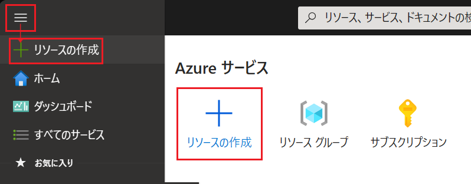

# 演習 0 : 富士通のルールに則ったリソース作成

富士通のプロジェクトでリソース作成を行う際、インターネット公開が必要なサービスが存在する場合

富士通内でセキュリティ検査を実施する必要があります。

一般的には上記申請が完了するまでは、プライベートな環境での構築が必要となります。

そのため、このアプリケーションを ルールに則り正しく動作させるには Azure ApplicationGatewayのほかにAzure WAF をデプロイし外部からの接続を制限する必要があります。

よって、この演習の手順は以下の 3 つとなります。

1. [**Azure ApplicationGatewayの作成**](#%E3%82%BF%E3%82%B9%E3%82%AF-1-azure-applicationgateway%E3%81%AE%E4%BD%9C%E6%88%90)
2. [**Azure WAFの作成**](#%E3%82%BF%E3%82%B9%E3%82%AF-2-azure-waf%E3%81%AE%E4%BD%9C%E6%88%90)
3. [**Azure WAFへのルールの追加**](#%E3%82%BF%E3%82%B9%E3%82%AF-3-azure-waf%E3%81%B8%E3%81%AE%E3%83%AB%E3%83%BC%E3%83%AB%E3%81%AE%E8%BF%BD%E5%8A%A0)

## 事前作成リソースと本演習で作成するリソース

事務局側で作成したリソースの構成図は以下になります。
 仮想マシン(handson-vm)内には、[事前準備](preparation.md) でのツール・プロジェクトが準備されています。
 必要に応じて上記資料を閲覧してください。

本演習を通して以下の構成図になるようリソース作成を進めていきます。

## タスク 1. Azure ApplicationGatewayの作成

Azure Application Gateway は、Web アプリケーションに対するトラフィックを管理できる Web トラフィック (OSI レイヤー 7) ロード バランサーです。 Application Gateway では、URI パスやホスト ヘッダーなど、HTTP 要求の追加属性に基づいてルーティングを決定できます。

Azure Application Gateway が提供する機能の詳細については以下のドキュメントを参照してください。

* [**Azure Application Gateway の機能**](https://learn.microsoft.com/ja-jp/azure/application-gateway/features)

このタスクでは Application Gateway 用の仮想ネットワークとサブネットに対して App Service ネットワーク設定でアクセスを許可するルール設定を行います。

Application Gateway のリソースを新規作成し、作成した仮想ネットワークとサブネットを関連付けます。

具体的な手順は以下のとおりです。

1. [Azure Portal](http://portal.azure.com) にログインします。

2. ポータル画面上部の \[**+**\] リソースの作成 アイコンか、表示されていない場合は画面左上のハンバーガーメニューをクリックし、\[**リソースの作成**\] をクリックします

    

3. \[**リソースの作成**\] 画面に遷移するので、検索ボックスに `Application Gateway` と入力し、表示された検索結果の \[**ストレージ アカウント**\] のタイルをクリックします

    

4. \[**Application Gateway**\] の画面に遷移するので、\[**作成**\] ボタンをクリックします

5. \[**アプリケーション ゲートウェイの作成**\] の \[**基本**\] タブ画面に遷移するので、各項目を以下のように設定します

    | 項目                  | 設定値                            |
    | :-------------------- | :-------------------------------- |
    | サブスクリプション \* | 使用するサブスクリプション        |
    | リソース グループ \*  | \[**PaaS_Handson**\]              |
    | ゲートウェイ名 \*     | `handson-AG`                      |
    | 地域 \*               | \[**(Asia Pacific) Japan East**\] |
    | レベル                | \[**Standard v2**\]               |
    | 自動スケール          | はい                              |
    | 最小インスタンス数 \* | 0                                 |
    | 最大インスタンス数 \* | 10                                |
    | 可用性ゾーン          | 既定、もしくは 1                  |
    | HTTP2                 | 無効                              |
    | 仮想ネットワーク \*   | \[`handson-AG-vnet`\]             |
    | サブネット \*         | \[`handson-AG-subnet`\]           |

    

    設定が完了したら画面下部の \[**次:フロントエンド \>**\] ボタンをクリックします。

6. \[**フロントエンド**\] タブの画面に遷移するので、\[**フロントエンド IP の種類**\] で、\[**両方**\] にチェックし、\[**パブリック IP アドレス**\] のドロップダウンボックスの下にある \[**新規作成**\] リンクをクリックします。

    \[**パブリック IP アドレスの追加**\] ポップアップが表示されるので、\[**名前 \***\] に `handson-AG-pip` と入力し \[**OK**\] ボタンをクリックします。

    

    \[**プライベート IPv4 アドレス**\] には、 サブネット内で利用されていないIP`10.1.0.4` と入力します。

    

    \[**次 : バックエンド \>**\] ボタンをクリックします。

7.  \[**バックエンド**\] タブの画面に遷移するので、\[**バックエンド プールの追加**\] リンクをクリックします

8. 画面右に \[**バックエンド プールの作成**\] ブレードが表示されるので、各項目を以下のように設定します

    | 項目                                                | 設定値                   |
    | :-------------------------------------------------- | :----------------------- |
    | 名前 \*                                             | `handson-AG-backendpool` |
    | ターゲットを持たないバックエンド プールを追加します | はい                   |

    >ターゲットは、演習1でターゲットとなるWebApp Serviceを 
    デプロイした後に指定します。

    設定が完了したら \[**追加**\] ボタンをクリックします。

    

    \[**バックエンド**\] タブの画面に戻るので、\[**次 : 構成 \>**\] ボタンをクリックします。

9.  \[**構成**\] タブの画面に遷移するので、画面中央の \[**+ ルーティング規則の追加**\] タイルをクリックします

    

    画面右に \[**+ ルーティング規則の追加**\] ブレードが表示されるので、各項目を以下のように設定します

    | 項目        | 設定値                   |
    | :---------- | :----------------------- |
    | ルール名 \* | `handson-AG-routingRule` |
    | 優先度 \* | `100` |

    \[**\* リスナー**\] タブ

    | 項目                   | 設定値                |
    | :--------------------- | :-------------------- |
    | リスナー名 \*          | `handson-AG-listener` |
    | フロントエンド IP \*   | \[**プライベート**\]    |
    | プロトコル             | \[**HTTP**\]          |
    | ポート \*              | \[**80**\]            |
    | リスナーの種類         | \[**Basic**\]         |
    | カスタム エラー ページ | 既定のまま指定しない  |

    

    \[**\* バックエンド ターゲット**\] タブ

    | 項目                       | 設定値                                                                                                                                                           |
    | :------------------------- | :--------------------------------------------------------------------------------------------------------------------------------------------------------------- |
    | ターゲットの種類\*         | \[**バックエンド プール**\]                                                                                                                                      |
    | バックエンド ターゲット \* | \[**handson-AG-backendpool**\]                                                                                                                                   |
    | バックエンド 設定 \*       | \[**handson-AG-backendSetting**\] (※)**新規追加** リンクをクリックすると \[**バックエンド設定の追加**\] ブレードが表示されるので別表の項目のとおりに設定して作成 |

    

    \[**バックエンド設定の追加**\] ブレード

    | 項目                               | 設定値                                               |
    | :--------------------------------- | :--------------------------------------------------- |
    | バックエンド設定名 \*              | `handson-AG-backendSetting`                          |
    | バックエンド プロトコル            | \[**HTTP**\]                                         |
    | バックエンド ポート            | \[**80**\]                                         |
    | Cookie ベースのアフィニティ        | \[**無効化**\]                                       |
    | 接続のドレイン                     | \[**有効化**\]                                       |
    | ドレイン タイムアウト (秒)                     | \[**60**\]                                       |
    | 要求のタイムアウト                 | `20`                                                 |
    | バックエンド パスのオーバーライド  | 指定なし                                             |
    | 新しいホスト名でオーバーライドする | \[**はい**\]                                         |
    | ホスト名をオーバーライドする       | \[**バックエンドターゲットからホスト名を選択する**\] |
    | カスタム プローブを作成する        | \[**はい**\]                                         |

    

    設定したら \[**追加**\] ボタンをクリックし、\[**+ ルーティング規則の追加**\] ブレードに戻ります。

    \[**\* バックエンド ターゲット**\] タブの項目 \[**バックエンド 設定 \***\] に先ほど作成した \[**handson-AG-backendSetting**\] が選択されていることを確認し、\[**追加**\] ボタンをクリックします。

10. \[**構成**\] タブの画面に戻るので、\[**次 : タグ \>**\] ボタンをクリックし、遷移した画面で \[**確認および作成**\] ボタンをクリックします。

    \[**作成**\] ボタンが有効になったらクリックしてデプロイを開始します。

    デプロイが完了すると \[**リソースに移動**\] ボタンが表示されるのでクリックして作成した Application Gateway のリソース画面に遷移します。

 

## タスク 2. Azure WAFポリシーの作成

Azure Application Gateway 上の Azure Web Application Firewall (WAF) は、一般的な悪用や脆弱性から Web アプリケーションを積極的に保護します。 Web アプリケーションが悪意のある攻撃の対象となる頻度が高くなるにつれて、これらの攻撃は、SQL インジェクションやクロスサイト スクリプティングなどの既知の脆弱性を悪用することが多くなっています。

このタスクでは タスク 1で作成したApplication Gateway に対して Azure WAFの割り当てを行います。

具体的な手順は以下のとおりです。

1. タスク 1で作成したApplication Gatewayのリソース画面を開きます。

2. 左タブの \[**Web アプリケーション ファイアウォール**\] をクリックします

3. 画面中央の\[**レベル**\]で \[**WAF V2**\]をクリックします
4. \[**WAFポリシー**\] のドロップダウンボックスの下にある \[**新規作成**\] リンクをクリックします。

    

5. 画面右に \[**Web Application Firewall ポリシーの作成**\] ブレードが表示されるので、各項目を以下のように設定します

    | 項目        | 設定値                   |
    | :---------- | :----------------------- |
    | 名前 \* | `handson-WAF-[チームID]` |
    | ボット保護の追加   | `選択しない`                    |

設定したら \[**OK**\] ボタンをクリックし、\[**Web アプリケーション ファイアウォール**\] ブレードに戻ります。

WAF ポリシーに入力した値が入っていることを確認し、 \[**保存**\] ボタンをクリックします。

 

## タスク 3. Azure WAFへのルールの追加

タスク 3ではタスク 2で作成したAzure WAFに対して、外部からの接続を拒否するポリシーを
設定します。

具体的な手順は以下のとおりです。

1. タスク 1で作成したApplication Gatewayのリソース画面を開きます。

2. 左タブの \[**Web アプリケーション ファイアウォール**\] をクリックし、関連するWebアプリケーションファイアウォールポリシーをクリックします

    

3. 遷移後の画面で左タブの \[**カスタム ルール**\] をクリックし、\[**カスタム ルールの追加**\]をクリックします

    

5. 画面右に \[**カスタム ルールの追加**\] ブレードが表示されるので、各項目を以下のように設定します

    | 項目                  | 設定値                            |
    | :-------------------- | :-------------------------------- |
    | カスタム ルール名 \* |   \[**CustomRule**\]        |
    | ルールを有効にする \*  | ■             |
    | ルールの種類 \*     | 一致                      |
    | 優先度 \*               | \[**10**\]|
    | 一致の種類                | IPアドレス              |
    | 演算          | \[**次の値を含まない**\]                             |
    | IP アドレスまたは範囲 \* | [**10.0.1.0/24**\]                                 |
    | 結果 \* | トラフィックを拒否する                                |

設定したら \[**追加**\] ボタンをクリックし、\[**カスタム ルール**\] ブレードに戻ります。

6. 画面下の \[**保存**\] ボタンをクリックし設定を保存します

 

## まとめ

この演習では、富士通でAzure構築を行う際の注意点を一般的な進め方について体験しました。

インターネットに公開する際は、以下のインターネット接続のセキュリティ検査を環境に応じて実施してください。

* [**インターネット接続のセキュリティ検査**](https://fujitsu.sharepoint.com/sites/jp-diagtech)

<!--
追加するリソース
https://techcommunity.microsoft.com/t5/apps-on-azure-blog/checklist-for-migrating-web-apps-to-app-service/ba-p/3810991

移行について
https://learn.microsoft.com/ja-jp/azure/app-service/app-service-migration-assess-net

https://learn.microsoft.com/ja-jp/azure/app-service/app-service-java-migration

-->

 

---
👉 : [**ローカル開発環境上の演習用アプリケーションを Azure App Service にデプロイ**](ex01.md)へ

👈 : [**演習 1 : ローカル開発環境上の演習用アプリケーションを Azure App Service にデプロイ**](preparation.md)へ

🏚️ :  [**README**](README.md)
