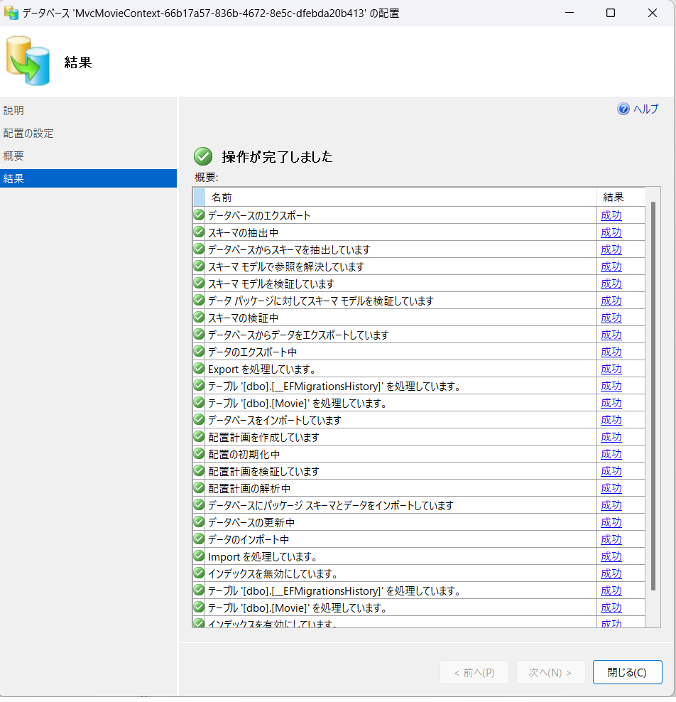
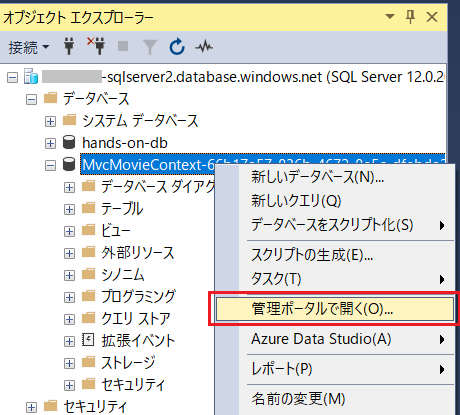
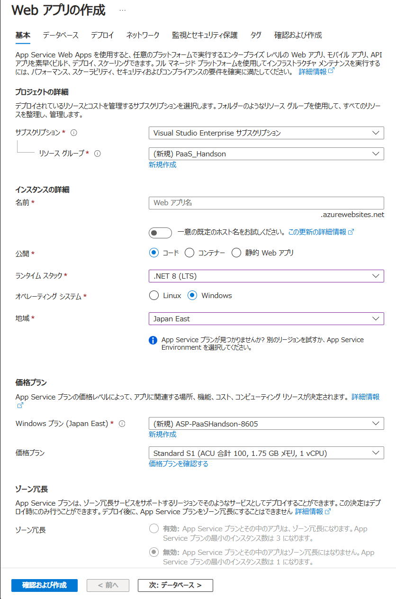
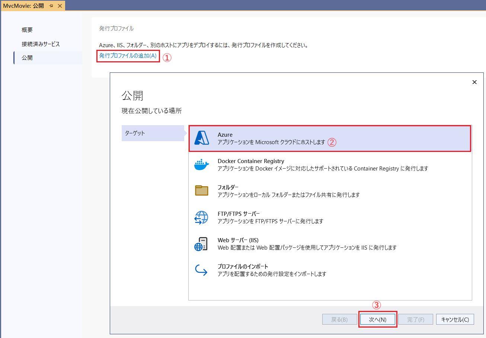
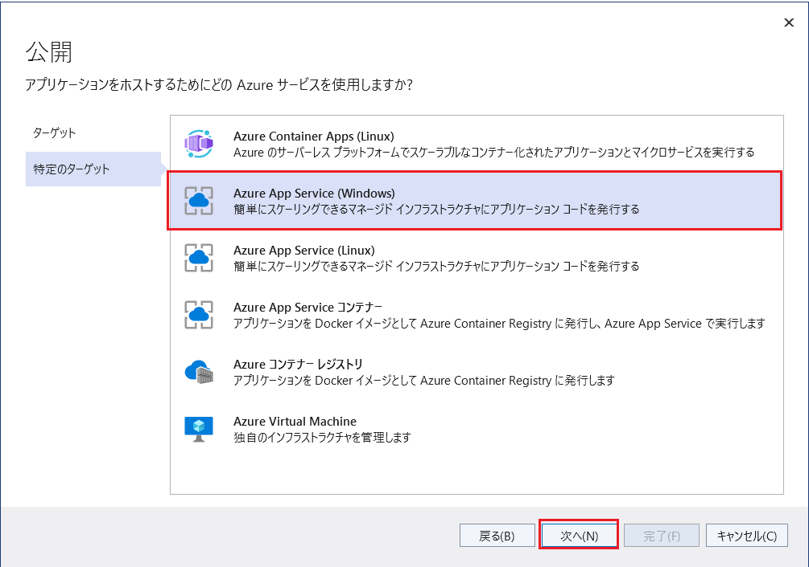
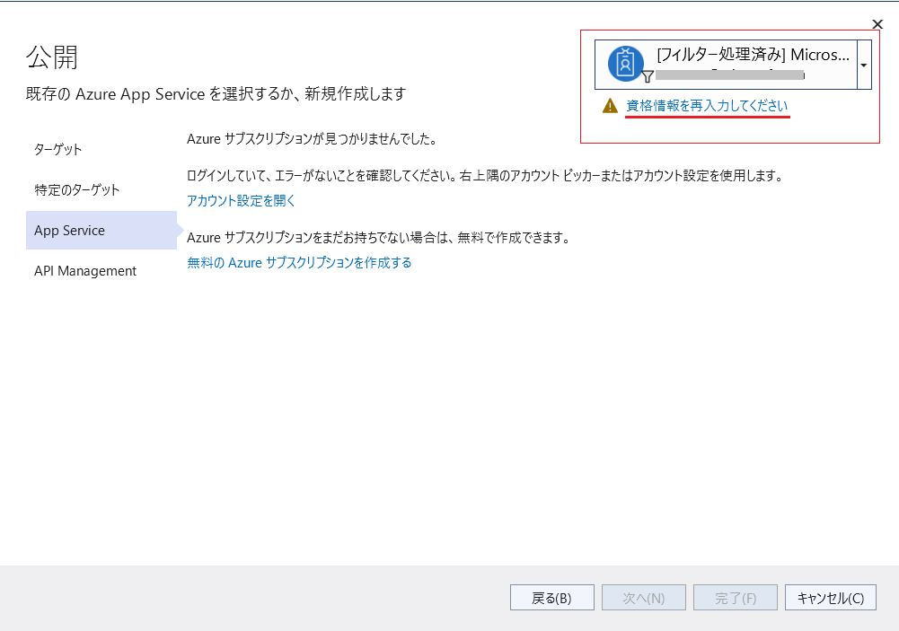
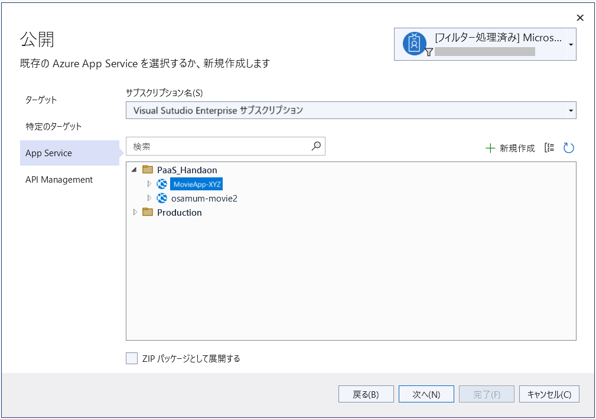
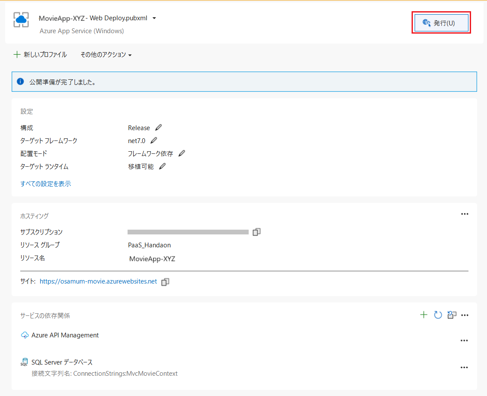
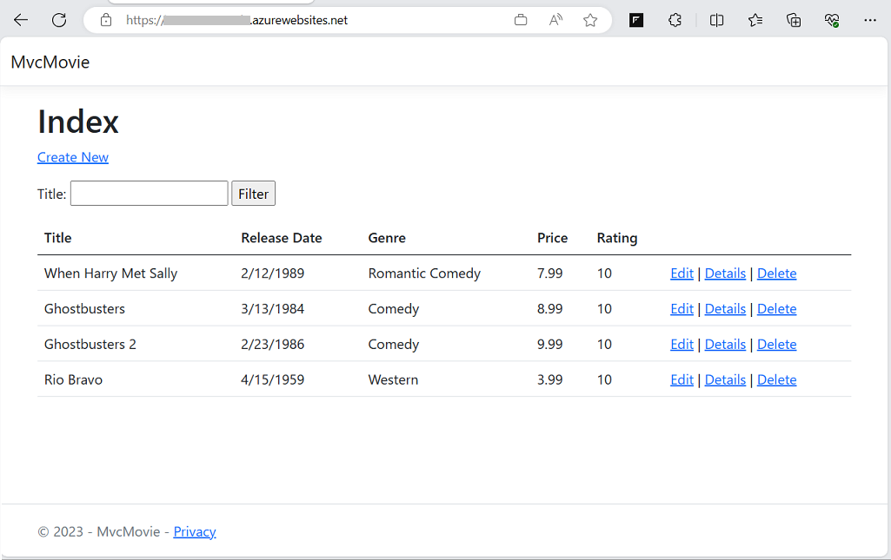

# 演習 1 : ローカル開発環境上の演習用アプリケーションを Azure App Service にデプロイ

GitHub から入手し、ローカルの開発環境で正常動作を確認した演習用アプリケーションを Azure App Service にデプロイします。

このアプリケーションは .NET7 ベースの MVC フレームワークを使用しており、データベースとして SQL Server Express LocalDB をベースとした Visual Studio 開発用データベースを使用しています。

そのため、このアプリケーションを Azure で正しく動作させるには AppService のほかに Azure SQL Database をデプロイしローカルのデータベースの内容を移行する必要があります。

よって、この演習の手順は以下の 4 つとなります。

1. [**Azure SQL Database インスタンスの作成**](#%E3%82%BF%E3%82%B9%E3%82%AF-1-azure-sql-database-%E3%82%A4%E3%83%B3%E3%82%B9%E3%82%BF%E3%83%B3%E3%82%B9%E3%81%AE%E4%BD%9C%E6%88%90)
2. [**Visual Studio 開発用データベースの内容を Azure SQL Database に移行**](#%E3%82%BF%E3%82%B9%E3%82%AF-2-visual-studio-%E9%96%8B%E7%99%BA%E7%94%A8%E3%83%87%E3%83%BC%E3%82%BF%E3%83%99%E3%83%BC%E3%82%B9%E3%81%AE%E5%86%85%E5%AE%B9%E3%82%92-azure-sql-database-%E3%81%AB%E7%A7%BB%E8%A1%8C)
3. [**AppService インスタンスの作成**](#%E3%82%BF%E3%82%B9%E3%82%AF-3-appservice-%E3%82%A4%E3%83%B3%E3%82%B9%E3%82%BF%E3%83%B3%E3%82%B9%E3%81%AE%E4%BD%9C%E6%88%90)
4. [**AppService にアプリケーションをデプロイ**](#%E3%82%BF%E3%82%B9%E3%82%AF-4-appservice-%E3%81%AB%E3%82%A2%E3%83%97%E3%83%AA%E3%82%B1%E3%83%BC%E3%82%B7%E3%83%A7%E3%83%B3%E3%82%92%E3%83%87%E3%83%97%E3%83%AD%E3%82%A4)

## タスク 1. Azure SQL Database インスタンスの作成

Azure Portal から Azure SQL Database インスタンスを作成します。

具体的な手順は以下の通りです。

1. [Azure Portal](http://portal.azure.com) にログインします。

2. ポータル画面上部の \[**+**\] リソースの作成 アイコンか、表示されていない場合は画面左上のハンバーガーメニューをクリックし、\[**リソースの作成**\] をクリックします

    

3. \[**リソースの作成**\] 画面に遷移するので、検索ボックスに `SQL` と入力し、表示された検索結果の \[**Azure SQL**\] のタイルをクリックします

    

4. \[**Azure SQL**\] の画面に遷移するので、\[**作成**\] ボタンをクリックします

    

5. \[**SQL デプロイ オプションを選択する**\] 画面に遷移するので、\[**SQL データベース**\] のタイル内の \[リソースの種類\] ドロップボックスの内容が `単一データベース` になっていることを確認し、\[**作成**\] ボタンをクリックします

    

6. \[**SQL データベースの作成**\] 画面に遷移するので、以下のように設定します
    
    | 設定項目 | 設定値 |
    |:--|:--|
    | サブスクリプション | ご利用のサブスクリプション |
    | リソース グループ | <u>新規作成</u> をクリックして `PaaS_Handson` という名前で作成 |
    | データベース名 | `hands-on-db` |
    | サーバー | \[**新規作成**\] をクリック |
    |(サーバーの作成画面) サーバー名 | `handson-sqlserver-XYZ`(※) |
    |(サーバーの作成画面) サーバーの場所 | `(Asia Pacific) Japan East` |
    |(サーバーの作成画面) 認証方法 | \[**SQL と Azure AD 認証の両方を使用する**\] にチェック|
    |(サーバーの作成画面) Azure AD 管理者の設定をする | \[**管理者の設定**\] リンクをクリックして現在 Azure にログインしているユーザーアカウントを指定 |
    |(サーバーの作成画面) サーバー管理者のログイン | `handson-sqladmin` |
    |(サーバーの作成画面) パスワード | `P@ssw0rd1234` |
    |(サーバーの作成画面) パスワードの確認 | `P@ssw0rd1234` |
    | SQL エラスティック プールを使用しますか?| \[**いいえ**\] |
    | ワークロード環境 | \[**開発**\] |
    | コンピューティングとストレージ | (既定のまま) |
    | バックアップ ストレージの冗長性| (既定のまま) |
    
    (※) この名前はユニークである必要があります。`hands-on-server-XZY` の `XYZ` を任意の文字列に置き換えてください。

    \[**作成および確認**\] ボタンをクリックし\[**作成**\] ボタンが表示されたらクリックします。

7. デプロイが完了すると \[**リソースに移動**\] ボタンが表示されますが、今回作成したデータベース `hands-on-db` は使用せず、このあとのタスク 2 の手順でローカル環境からエクスポートしたデータベースを使用しますので、\[**リソースに移動**\] ボタンはクリックせずに、\[**閉じる**\] ボタンをクリックして画面を閉じます

9. 作成した **Azure SQL サーバー** の画面を表示します。これには Azure ポータルのホーム画面で作成した Azure SQL サーバー名  `hands-on-server-XZY` を検索するか、Azure SQL データベースの画面の \[**概要**\] タブ内の \[**サーバー名**\] をクリックして表示される画面の \[**サーバー名**\] をクリックします

10. Azure SQL データベースの画面に遷移したら、左のメニューから \[**ネットワーク**\] をクリックします

11. \[**ネットワーク**\] 画面に遷移するので \[**パブリック ネットワーク アクセス**\] で \[**選択したネットワーク**\] をチェックします

    \[**ファイヤーウォール規則**\] のところに既にお使いのクライアントの IP アドレスが設定されたメニュー \[**+ クライアント IPv4 アドレス(%IPアドレス%) の追加**\] メニューがあるので、これをクリックします

    \[**例外**\] のセクションにある \[**Azure サービスおよびリソースにこのサーバーへのアクセスを許可する**\] にチェックを入れ、\[**保存**\] ボタンをクリックします

    


ここまでの手順で Azure SQL Database のインスタンスが作成され、データベース移行作業に必要となる Azure SQL Database への接続文字列を取得し、開発環境からの接続を許可する設定が完了しました。

<br>

## タスク 2. Visual Studio 開発用データベースの内容を Azure SQL Database に移行

Visual Studio 開発用データベースの内容を Azure SQL Database に移行します。この作業には SQL Management Studio を使用して行いますが、ローカルで動作しているデータベースの名前を確認するためと、データベースを起動した状態とするために Visual Studio で演習用アプリケーションのプロジェクトを開いたまま作業を行います。

具体的な手順は以下の通りです。

1. Visual Studio で演習用アプリケーションのプロジェクトを開きます

2. メニューバーから \[**表示**\] > \[**SQL サーバー オブジェクト　エクスプローラー**\] をクリックします

3. **SQL サーバー オブジェクト　エクスプローラー** が表示されるので、同画面のツリーから \[SQL Server\] - \[(localdb)\MSSQLLocalDB(SQL Server %バージョン%)\] - \[データベース\] - \[**MvcMovieContext-%GUID%**\] を右クリックし、表示されたコンテキスト メニューから \[**プロパティ**\] をクリックします

    

4. \[**プロパティ**\] 画面が表示されるので、\[**サーバー**\] の値をコピーしてメモ帳などに保持しておきます

    

    >【注意】 Visual Studio 開発用データベース(SQL Server Express LocalDB) への接続文字列はプロジェクト中の appsettings.json に記述されていますが、この内容はエスケープ文字が混じっており、そのままでは他のツールで使用できません。そのため、SQL Server 名や接続文字列を取得する際には、Visual Studio 開発用データベースのプロパティ画面から取得することをお勧めします。

    なお、データベースの移行作業が完了するまで Visual Studio は起動したままにしておきます。これは Visual Studio が終了すると開発用データベースに接続できなくなってしまうためです。

5. SQL Server Management Studio を起動します

    \[**サーバーへの接続**\] ダイアログボックスが表示されるので、以下のように設定します。

    | 設定項目 | 設定値 |
    |:--|:--|
    | サーバー種類 | \[データベース エンジン\] |
    | サーバー名 | 前の手順で保持しておいた Visual Studio 開発用データベースのサーバー名 |
    | 認証 | \[Windows 認証\] |

    \[**接続**\] ボタンをクリックします

    

6. \[オブジェクト エクスプローラー\] にデータベースのツリーが表示されるので、\[(localdb)\MSSQLLocalDB(SQL Server %バージョン%)\] - \[データベース\] - \[**MvcMovieContext-%GUID%**\] を右クリックし、表示されたコンテキスト メニューから \[**タスク**\] > \[**Microsoft Azure SQL Database へのデータベースの配置...**\] をクリックします

    

7. \[**配置の設定**\] ダイアログボックスが表示されるので、\[**接続**\] ボタンをクリックします。

    \[**サーバーへの接続**\] ダイアログボックスが表示されるので、各項目を以下のように設定します。

    | 設定項目 | 設定値 |
    |:--|:--|
    | サーバー種類 | \[データベース エンジン\] |
    | サーバー名 | `演習 1-1 で作成した Azure SQL サーバーの名前(※)`|
    | 認証 | \[SQL Server 認証\] |
    | ログイン | `handson-sqladmin` |
    | パスワード | `P@ssw0rd1234` |

    (※) 前の手順 [**1. Azure SQL Database インスタンスの作成**](#1-azure-sql-database-%E3%82%A4%E3%83%B3%E3%82%B9%E3%82%BF%E3%83%B3%E3%82%B9%E3%81%AE%E4%BD%9C%E6%88%90) でコピーしておいた接続文字列からサーバー名を取得し、\[**サーバー名**\] に貼り付けます

    

    \[**接続**\] ボタンをクリックすると、\[**配置の設定**\] ダイアログボックスに戻るので、他の設定は既定のまま \[次へ\] ボタンをクリックします

8. \[指定して設定の検証\] 画面に遷移するので、\[**完了**\] ボタンをクリックすると、データベースの移行作業が開始され、\[進行状況\] が表示されるので、完了するまで待ちます

9. 移行作業が完了すると、\[**結果**\] 画面に遷移するので、すべての操作の結果が `成功`であることを確認し、\[**閉じる**\] ボタンをクリックします

    

    ここまでの手順で、Visual Studio 開発用データベースの内容が Azure SQL Database に移行されたはずですが、念のために SQL Management Server から Azure SQL Database に接続してデータベースの内容を確認します。

10. \[オブジェクト エクスプローラー\] 上部の \[オブジェクト エクスプローラーを接続\] ボタンをクリックします

    

11. \[**サーバーへの接続**\] ダイアログボックスが、接続情報が設定された状態で表示されるので \[**接続**\] ボタンをクリックします

12. 接続が成功すると \[オブジェクト エクスプローラー\] に Azure Database のツリーが表示されるので、\[**データベース**\] - \[**MvcMovieContext-%GUID%**\] - \[**テーブル**\] - \[**dbo.Movie**\]を右クリックし、表示されたコンテキスト メニューから \[**上位 1000 行の選択**\] をクリックします

     

    クエリーが実行されて、データベースの内容が表示されます。ここで、ローカルの開発環境で作成したデータベースの内容が Azure SQL Database に移行されていることが確認できました。

    

13. ここまでの作業で Azure SQL Server にエクスポートしたデータベースへの接続文字列を取得します

    \[オブジェクト エクスプローラー\] でエクスポートしたデータベースのツリーを右クリックし、表示されたコンテキスト メニューから \[**管理ポータルで開く**\] をクリックします。

    


    Web ブラウザーに Azure Portal が開き、Azure 上の SQL Database の一覧が表示されるので、エクスポートしたデータベースをクリックします

14. 選択したデータベースの設定画面に遷移するので、画面左のメニューから \[**接続文字列**\] をクリックし、遷移した画面の \[**ADO.NET**\] タブ内の \[**ADO.NET (SQL 認証)**\]接続文字列をコピーして、メモ帳などで保持しておきます

    


ここまでの作業で Visual Studio 開発用データベースを Azure SQL Database に移行する作業と接続情報の取得は完了です。

<br>

## タスク 3. AppService インスタンスの作成

演習用アプリケーションのデプロイ先となる Azure AppService インスタンスを作成します。

Visual Studio は、Azure AppService に対してデプロイするための設定を行うためのツールを提供しています。このツールを使用すると、Azure AppService の作成も行えますが、作業内容を別けるためにここでは Azure Portal から作成する手順を説明します。

具体的な手順は以下の通りです。

1. Azure ポータルにサインインします

    https://portal.azure.com

2. ポータル画面上部の \[**+**\] リソースの作成 アイコンか、表示されていない場合は画面左上のハンバーガーメニューをクリックし、\[**リソースの作成**\] をクリックします

    

3. 多くの場合、遷移した画面に \[**Web アプリ**\] がリストされているはずですが、

    

    もしリストされていない場合は画面左のメニューから \[**Web**\]をクリックししてください。

4. \[**Web アプリ**\]のタイルをクリックすると、\[**Web アプリの作成**\] 画面が表示されます

    

    設定項目は以下のとおりです。

    
    |  項目  |  値  |
    | ---- | ---- |   
    | サブスクリプション * | 使用する Azure サブスクリプション |
    | リソースグループ * | `PaaS_Handson` |
    | 名前 * | `MovieApp-XYZ`(※1)|
    | 公開 * | **コード**|
    | ランタイム スタック * | **.NET 7 (STS)** |
    | オペレーティングシステム * | **Windows** |
    | 地域 * | **(Asia Paciffic) Japan East** |
    | App Service プラン(場所) * | 既定のまま |
    | 価格プラン * | **Free F1 (共有インフラストラクチャ)** |

    (※1) この名前はユニークである必要があります。`MovieApp-XYZ` の `XYZ` を任意の文字列に置き換えてください。

    (※2) この手順では開発検証用の無料プランを使用します。ただし、無料プランでは AppService のインスタンスが 1 つしか作成できないため、デプロイスロット、スケールアウト設定が行えません。これらの機能を使用するには、AppService のプランを変更する必要があります。
    詳細は [**Azure App Service プランの概要**](https://learn.microsoft.com/ja-jp/azure/app-service/overview-hosting-plans) を参照してください。

    運用環境では Standard 以上のプランを使用することをお勧めします。以降の手順では必要に応じてプランを変更して演習を行います。

5. フォームへの入力が完了したら \[**確認および作成**\] ボタンをクリックし、ボタンの表示が \[**作成**\] に変わったらクリックします。 

    AppService のデプロイが開始されます。

6. デプロイが完了すると、\[**リソースに移動**\] ボタンが表示されるのでクリックします

7. 作成した AppService の画面の \[**概要**\] 画面に遷移するので、同画面内の \[**既定のドメイン**\] をクリックすると、ブラウザで AppService のトップページが表示されることを確認します

    

ここまでの手順で、AppService インスタンスが作成されました。

次のタスクでは Visual Studio から直接 AppService にアプリケーションをデプロイします。

<br>

## タスク 4. AppService にアプリケーションをデプロイ

演習用アプリケーションが使用しているデータベースの接続先を Visual Studio 開発用ローカル DB からタスク 2 の手順で移行した Azure SQL Database に切り替えます。この作業ではプロジェクト中の appsettings.json の内容を変更します。

その後、Visual Studio の \[**発行**\] 機能を使用して AppService にアプリケーションをデプロイします。

具体的な手順は以下の通りです。

1. Visual Studio で演習用アプリケーションのプロジェクトを開きます

2. プロジェクト エクスプローラーでファイル **appsettings.json** をダブルクリックして編集状態にします

3. 編集画面の JSON の \[**ConnectionStrings**\] の **MovieContext** の値を、タスク 2 の手順で取得した Azure SQL Database への接続文字列に変更します。

    ```json
    "ConnectionStrings": {
        "MovieContext": "タスク 2 の手順で取得した Azure SQL Database への接続文字列"
    }
    ```

    >【注意】タスク 2 の手順で取得した SQL Database の接続文字列にはパスワードが含まれていませんので、接続文字列中の **{your_username}** という箇所を、タスク 1 の手順で設定したパスワードにかならず変更してください。

    > 【メモ】この値は Azure AppService にデプロイ後、環境変数で変更することができます。具体的な変更方法については演習 2  で紹介します。

4. 前の手順で行った Azure SQL Database への接続が正しく行えるかを確認するために、Visual Studio でアプリケーションを実行します。

    タスク 1 の手順 11 で、Azure Database のネットワークアクセスの許可設定も行っているので、ローカルの開発環境から直接 Azure SQL Database に接続できます。

    メニューバーから \[**デバッグ**\] > \[**デバッグの開始**\] をクリックするか、キーボードの \[**F5**\] キーを押下してプロジェクトを実行し、アプリケーションが正しく動作するか確認してください。

    もし、うまくいかない場合は SQL Database への接続文字列とネットワーク許可設定を確認してください。

5. Visual Studio でのデバッグを停止し、\[**発行**\] 機能を使用して AppService にアプリケーションをデプロイします。

    メニューバーから \[**ビルド**\] > \[**MvcMovie の発行**\] をクリックするか、\[ソリューション エクスプローラー\] のツリーで \[**MvcMovie**\] プロジェクトを右クリックし、表示されたコンテキスト メニューから \[**発行**\] をクリックします

6. \[公開\] 画面に遷移するので画面の \[**発行プロファイル追加**\] リンクをすると \[**公開**\] ダイアログ ボックスが表示されるので同ダイアログ ボックスの \[**ターゲット**\] リストから \[**Azure**\] を選択し、\[**次へ**\] ボタンをクリックします 

    

7. \[**特定のターゲット**\] リストに遷移するので \[**Azure App Service (Windows)**\] を選択し\[**次へ**\]ボタンをクリックします

    

8. \[**App Service**\] 画面が表示されるので、画面右上のドロップダウンボックスが \[**アカウントを追加します : Microsoft 仕事、学校、個人用のアカウント**\] となっている場合はそちらをクリック、もしくは \[**フィルター済**\] というところに Azure の資格情報が表示されているにもかかわらず \[**資格情報を再入力してください**\] と表示がある場合にはもそのリンクをクリックします 

    

    \[**アカウントにサインイン**\] ボックスが表示されるので、Azure の資格情報を入力して \[**サインイン**\] ボタンをクリックします

9. 正しくサインインできると \[**App Service**\] 画面に遷移するので、\[**サブスクリプション**\] リストからご利用のサブスクリプションを選択し、\[**リソース グループ**\] リストから \[**PaaS_Handson**\] を選択します

    

     \[**次へ**\] ボタンをクリックします。

10. \[**API Management**\] 画面が表示されるので、\[**この手順をスキップする**\] にチェックをつけて \[**完了**\] ボタンをクリックします

    発行プロファイルの作成が完了すると \[**完了**\] 画面に遷移するので \[**閉じる**\] ボタンをクリックしてダイアログボックスを閉じます

11. \[**公開**\] 画面に戻るので、画面右上の \[**発行**\] ボタンをクリックするアプリケーションのビルド完了後、デプロイが開始されます。

    

デプロイが完了すると、ブラウザが起動し AppService のアプリケーションのトップページが表示されますので、アプリケーションが正しく動作するか確認してください。



なお、デプロイが完了までには数分かかる場合があります。デプロイが完了するまで待おまちください。

>【注意】もし、アプリケーションの画面が表示されず HTTP500.30 エラーが返る場合は Azure SQL Database への接続文字列に誤りがないか確認してください。また、ASP.NET Core アプリケーションの場合、Azure App Service の \[**構成**\] 画面で、環境変数として **ASPNETCORE_ENVIRONMENT** を追加し、値を `Development` とすることで [開発者例外ページ](https://learn.microsoft.com/ja-jp/aspnet/core/fundamentals/error-handling?view=aspnetcore-7.0#developer-exception-page) が有効になり、スタック トレース等のデバックに必要な情報が表示されるようになれますのでご活用ください。

ここまでの手順で、ローカルの開発環境からの Azure AppService へのデプロイ作業は完了です。

この手順ではデプロイに Visual Studio を使用しましたが、Azure AppService には他の方法も使用できます。具体的な方法については演習 2 で紹介します。

<br>


## まとめ

この演習では、Azure 上に Web アプリケーションをデプロイするための環境と実際の移行方法について体験しました。

App Service に Web サイトをデプロイする方法についてのトレーニング資料が用意されておりますので、こちらもご活用ください。

* [**Azure App Service で Web アプリケーションをホストする**](https://learn.microsoft.com/ja-jp/training/modules/host-a-web-app-with-azure-app-service/)

* [**Visual Studio を使用して Azure に Web アプリを発行する**](https://learn.microsoft.com/ja-jp/training/modules/publish-azure-web-app-with-visual-studio/)

今回は Visual Studio を使用して ASP.NET Core アプリケーションをデプロイしましたが、他の開発言語についても以下のドキュメントをが用意されておりますのでご活用ください。

### 開発言語ごとのデプロイ方法

* **C# : [ASP.NET Web アプリをデプロイする](https://learn.microsoft.com/ja-jp/azure/app-service/quickstart-dotnetcore?tabs=net70&pivots=development-environment-vs)**

* **Java : [Azure App Service で Java アプリを作成する](https://learn.microsoft.com/ja-jp/azure/app-service/quickstart-java?tabs=javase&pivots=platform-linux-development-environment-maven)**

* **PHP : [Azure App Service に PHP Web アプリを作成する](https://learn.microsoft.com/ja-jp/azure/app-service/quickstart-php?tabs=cli&pivots=platform-linux)**

* **JavaScript : [Azure で Node.js Web アプリをデプロイする](https://learn.microsoft.com/ja-jp/azure/app-service/quickstart-nodejs?tabs=windows&pivots=development-environment-vscode)**

* **Python : [Python (Django または Flask) Web アプリを Azure App Service にデプロイする](https://learn.microsoft.com/ja-jp/azure/app-service/quickstart-python?tabs=flask%2Cwindows%2Cazure-cli%2Cvscode-deploy%2Cdeploy-instructions-azportal%2Cterminal-bash%2Cdeploy-instructions-zip-azcli)**

* **Ruby : [App Service で Ruby on Rails アプリを作成する](https://learn.microsoft.com/ja-jp/azure/app-service/quickstart-ruby?tabs=cli)**

* **Go : [Go Web アプリを Azure App Service に配置する](https://learn.microsoft.com/ja-jp/azure/app-service/quickstart-golang)**


### 開発環境ごとのデプロイ方法

* **Visual Studio : [Visual Studio を使用して Azure に Web アプリを発行する](https://learn.microsoft.com/ja-jp/training/modules/publish-azure-web-app-with-visual-studio/)**

* **Visual Studio : [Azure App Service と Visual Studio Code を使用して Web アプリケーションを作成して発行する](https://learn.microsoft.com/ja-jp/training/modules/create-publish-webapp-app-service-vs-code/)**


<br>

---
👉 : [**演習2) Web サイトを運用するための基本的な設定**](ex02.md)へ

🏚️ :  [**README**](README.md)


    


  


