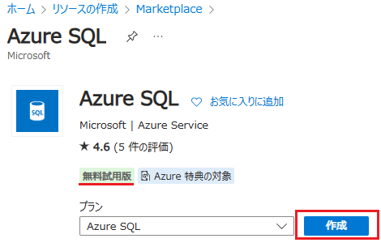
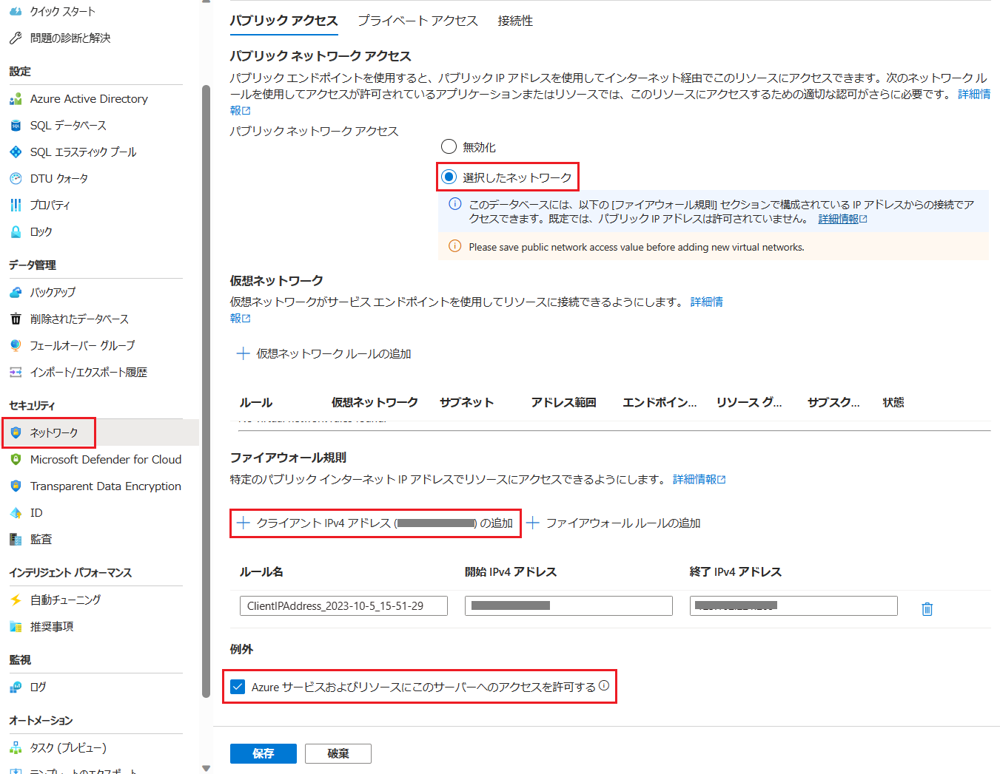

# 演習 1 : ローカル開発環境上の演習用アプリケーションを Azure App Service にデプロイ

GitHub から入手し、ローカルの開発環境で正常動作を確認した演習用アプリケーションを Azure App Service にデプロイします。

このアプリケーションは .NET7 ベースの MVC フレームワークを使用しており、データベースとして SQL Server Express LocalDB をベースとした Visual Studio 開発用データベースを使用しています。

そのため、このアプリケーションを Azure で正しく動作させるには AppService のほかに Azure SQL Database をデプロイしローカルのデータベースの内容を移行する必要があります。

よって、この演習の手順は以下の 4 つとなります。

1. Azure SQL Database インスタンスの作成
2. Visual Studio 開発用データベースの内容を Azure SQL Database に移行
3. AppService インスタンスの作成
4. AppService にアプリケーションをデプロイ

## タスク 1. Azure SQL Database インスタンスの作成

Azure Portal から Azure SQL Database インスタンスを作成します。

具体的な手順は以下の通りです。

1. [Azure Portal](http://portal.azure.com) にログインします。

2. ポータル画面上部の \[**+**\] リソースの作成 アイコンか、表示されていない場合は画面左上のハンバーガーメニューをクリックし、\[**リソースの作成**\] をクリックします

    

3. \[**リソースの作成**\] 画面に遷移するので、検索ボックスに `SQL` と入力し、表示された検索結果の \[**Azure SQL**\] のタイルをクリックします

    

4. \[**Azure SQL**\] の画面に遷移するので、\[**作成**\] ボタンをクリックします

    

5. \[**SQL デプロイ オプションを選択する**\] 画面に遷移するので、\[**SQL データベース**\] のタイル内の \[リソースの種類\] ドロップボックスの内容が `単一データベース` になっていることを確認し、\[**作成**\] ボタンをクリックします

    

6. \[**SQL データベースの作成**\] 画面に遷移するので、以下のように設定します
    
    | 設定項目 | 設定値 |
    |:--|:--|
    | サブスクリプション | ご利用のサブスクリプション |
    | リソース グループ | ご利用のリソース グループ |
    | データベース名 | `hands-on-db` |
    | サーバー | \[**新規作成**\] をクリック |
    |(サーバーの作成画面) サーバー名 | `handson-sqlserver-XYZ`(※) |
    |(サーバーの作成画面) サーバーの場所 | `(Asia Pacific) Japan East` |
    |(サーバーの作成画面) 認証方法 | \[**SQL と Azure AD 認証の両方を使用する**\] にチェック|
    |(サーバーの作成画面) Azure AD 管理者の設定をする | \[**管理者の設定**\] リンクをクリックして現在 Azure にログインしているユーザーアカウントを指定 |
    |(サーバーの作成画面) サーバー管理者のログイン | `handson-sqladmin` |
    |(サーバーの作成画面) パスワード | `P@ssw0rd1234` |
    |(サーバーの作成画面) パスワードの確認 | `P@ssw0rd1234` |
    | SQL エラスティック プールを使用しますか?| \[**いいえ**\] |
    | ワークロード環境 | \[**開発**\] |
    | コンピューティングとストレージ | (既定のまま) |
    | バックアップ ストレージの冗長性| (既定のまま) |
    
    (※) この名前はユニークである必要があります。`hands-on-server-XZY` の `XYZ` を任意の文字列に置き換えてください。

    \[**作成および確認**\] ボタンをクリックし\[**作成**\] ボタンが表示されたらクリックします。

7. デプロイが完了すると \[**リソースに移動**\] ボタンが表示されるので同ボタンをクリックして作成した Azure SQL Database の画面に遷移します

8. 画面左のメニューから \[**接続文字列**\] をクリックし、遷移した画面の \[**ADO.NET**\] タブ内の \[**ADO.NET (SQL 認証)**\]接続文字列をコピーして、メモ帳などで保持しておきます

    

    次に Azure 上の SQL Server に開発環境からの接続を許可するための設定を行います

9. 作成した Azure SQL サーバーの画面を表示します。これには Azure ポータルのホーム画面で作成した Azure SQL サーバー名  `hands-on-server-XZY` を検索するか、Azure SQL データベースの画面の \[**概要**\] タブ内の \[**サーバー名**\] をクリックして表示される画面の \[**サーバー名**\] をクリックします

10. Azure SQL データベースの画面に遷移したら、左のメニューから \[**ネットワーク**\] をクリックします

11. \[**ネットワーク**\] 画面に遷移するので \[**パブリック ネットワーク アクセス**\] で \[**選択したネットワーク**\] をチェックします

    \[**ファイヤーウォール規則**\] のところに既にお使いのクライアントの IP アドレスが設定されたメニュー \[**+ クライアント IPv4 アドレス(%IPアドレス%) の追加**\] メニューがあるので、これをクリックします

    \[**例外**\] のセクションにある \[**Azure サービスおよびリソースにこのサーバーへのアクセスを許可する**\] にチェックを入れ、\[**保存**\] ボタンをクリックします

    

ここまでの手順で Azure SQL Database のインスタンスが作成され、データベース移行作業に必要となる Azure SQL Database への接続文字列を取得し、開発環境からの接続を許可する設定が完了しました。

 

## タスク 2. Visual Studio 開発用データベースの内容を Azure SQL Database に移行

Visual Studio 開発用データベースの内容を Azure SQL Database に移行します。この作業には SQL Management Studio を使用して行いますが、ローカルで動作しているデータベースの名前を確認するためと、データベースを起動した状態とするために Visual Studio で演習用アプリケーションのプロジェクトを開いたまま作業を行います。

具体的な手順は以下の通りです。

1. Visual Studio で演習用アプリケーションのプロジェクトを開きます

2. メニューバーから \[**表示**\] > \[**SQL サーバー オブジェクト　エクスプローラー**\] をクリックします

3. **SQL サーバー オブジェクト　エクスプローラー** が表示されるので、同画面のツリーから \[SQL Server\] - \[(localdb)\MSSQLLocalDB(SQL Server %バージョン%)\] - \[データベース\] - \[**MvcMovieContext-%GUID%**\] を右クリックし、表示されたコンテキスト メニューから \[**プロパティ**\] をクリックします

    

4. \[**プロパティ**\] 画面が表示されるので、\[**サーバー**\] の値をコピーしてメモ帳などに保持しておきます

    

    >【注意】 Visual Studio 開発用データベース(SQL Server Express LocalDB) への接続文字列はプロジェクト中の appsettings.json に記述されていますが、この内容はエスケープ文字が混じっており、そのままでは他のツールで使用できません。そのため、SQL Server 名や接続文字列を取得する際には、Visual Studio 開発用データベースのプロパティ画面から取得することをお勧めします。

    なお、データベースの移行作業が完了するまで Visual Studio は起動したままにしておきます。これは Visual Studio が終了すると開発用データベースに接続できなくなってしまうためです。

5. SQL Server Management Studio を起動します

    \[**サーバーへの接続**\] ダイアログボックスが表示されるので、以下のように設定します。

    | 設定項目 | 設定値 |
    |:--|:--|
    | サーバー種類 | \[データベース エンジン\] |
    | サーバー名 | 前の手順で保持しておいた Visual Studio 開発用データベースのサーバー名 |
    | 認証 | \[Windows 認証\] |

    \[**接続**\] ボタンをクリックします

    

6. \[オブジェクト エクスプローラー\] にデータベースのツリーが表示されるので、\[(localdb)\MSSQLLocalDB(SQL Server %バージョン%)\] - \[データベース\] - \[**MvcMovieContext-%GUID%**\] を右クリックし、表示されたコンテキスト メニューから \[**タスク**\] > \[**Microsoft Azure SQL Database へのデータベースの配置...**\] をクリックします

    

7. \[**配置の設定**\] ダイアログボックスが表示されるので、\[**接続**\] ボタンをクリックします。

    \[**サーバーへの接続**\] ダイアログボックスが表示されるので、各項目を以下のように設定します。

    | 設定項目 | 設定値 |
    |:--|:--|
    | サーバー種類 | \[データベース エンジン\] |
    | サーバー名 | `演習 1-1 で作成した Azure SQL サーバーの名前(※)`|
    | 認証 | \[SQL Server 認証\] |
    | ログイン | `handson-sqladmin` |
    | パスワード | `P@ssw0rd1234` |

    (※) 前の手順 [**1. Azure SQL Database インスタンスの作成**](#1-azure-sql-database-%E3%82%A4%E3%83%B3%E3%82%B9%E3%82%BF%E3%83%B3%E3%82%B9%E3%81%AE%E4%BD%9C%E6%88%90) でコピーしておいた接続文字列からサーバー名を取得し、\[**サーバー名**\] に貼り付けます

    

    \[**接続**\] ボタンをクリックすると、\[**配置の設定**\] ダイアログボックスに戻るので、他の設定は既定のまま \[次へ\] ボタンをクリックします

8. \[指定して設定の検証\] 画面に遷移するので、\[**完了**\] ボタンをクリックすると、データベースの移行作業が開始され、\[進行状況\] が表示されるので、完了するまで待ちます

9. 移行作業が完了すると、\[**結果**\] 画面に遷移するので、すべての操作の結果が `成功`であることを確認し、\[**閉じる**\] ボタンをクリックします

    

    ここまでの手順で、Visual Studio 開発用データベースの内容が Azure SQL Database に移行されたはずですが、念のために SQL Management Server から Azure SQL Database に接続してデータベースの内容を確認します。

10. \[オブジェクト エクスプローラー\] 上部の \[オブジェクト エクスプローラーを接続\] ボタンをクリックします

    

11. \[**サーバーへの接続**\] ダイアログボックスが、接続情報が設定された状態で表示されるので \[**接続**\] ボタンをクリックします

12. 接続が成功すると \[オブジェクト エクスプローラー\] に Azure Database のツリーが表示されるので、\[**データベース**\] - \[**MvcMovieContext-%GUID%**\] - \[**テーブル**\] - \[**dbo.Movie**\]を右クリックし、表示されたコンテキスト メニューから \[**上位 1000 行の選択**\] をクリックします

     

    クエリーが実行されて、データベースの内容が表示されます。ここで、ローカルの開発環境で作成したデータベースの内容が Azure SQL Database に移行されていることが確認できました。

    

ここまでの作業で Visual Studio 開発用データベースを Azure SQL Database に移行する作業は完了です。次に、この Azure SQL Database に接続するための接続文字列を Azure App Service に設定します。

