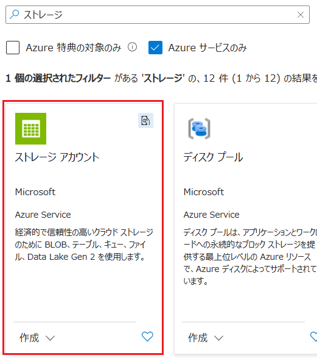
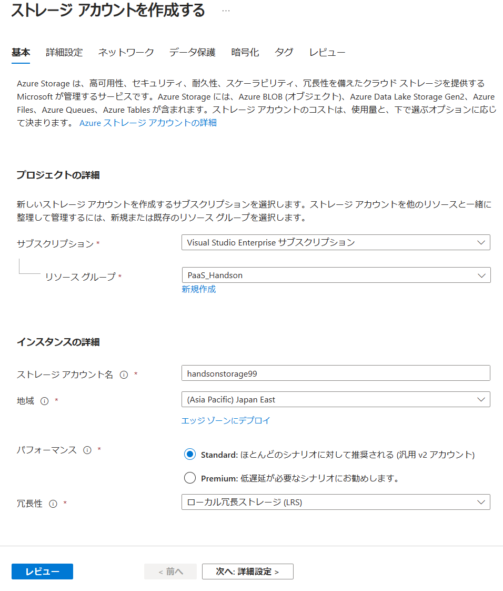

# 演習 2 : Web サイトを運用するための基本的な設定

この演習では、[演習 1](ex01.md) で Azure App Servive(Web App) に移行した アプリケーションを Web サイトとして運用するための基本的な設定を行います。

この演習では、一般的な Web サイトでコンテンツをホストする際に必要となる以下の基本的な内容について手順を実施します。ただし、ドメインの購入など実施がむつかしいものについては手順の説明のみを行います。

* App Service ログの設定と有効化
* バックアップ
* カスタム ドメインの設定
* CORS 設定
* 認証について

 

## タスク 1 : App Service ログの設定と有効化

一般的な Web サーバーの場合、既定の状態でアクセスログやエラーログなどのログが出力されますが、App Service では既定ではログが出力されないため、ログの設定と有効化を行う必要があります。

ログの出力先は Azure Storage (Blob) と  App Service ファイル システムの 2 種類がありますがこのタスクでは Azure Storage アカウントを使用します。

ログの出力先となる Azure Storage アカウントは \[**App Service ログ**\]の設定画面から作成することもできますが、混乱を避けるためにAzure Storage アカウントの作成と、\[**App Service ログ**\] の設定手順を別けて説明します。

はじめに Azure Storage アカウントを作成します。

具体的な手順は以下の通りです。

### タスク 1.1 : Azure Storage アカウントの作成

1. [Azure Portal](http://portal.azure.com) にログインします。

2. ポータル画面上部の \[**+**\] リソースの作成 アイコンか、表示されていない場合は画面左上のハンバーガーメニューをクリックし、\[**リソースの作成**\] をクリックします

    

3. \[**リソースの作成**\] 画面に遷移するので、検索ボックスに `ストレージ` と入力し、表示された検索結果の \[**ストレージ アカウント**\] のタイルをクリックします

    

4. \[**ストレージ アカウント**\] の画面が表示されるので、\[**作成**\] ボタンをクリックします

5. \[**ストレージ アカウントを作成する**\] 画面に遷移するので、各項目を以下の通り入力します

    |項目|値|
    |---|---|
    |サブスクリプション|使用するサブスクリプション|
    |リソース グループ|`PaaS_Handson`|
    |ストレージ アカウント名|`handsonstorage99`(※1)|
    | 地域 * | \[**(Asia Paciffic) Japan East**\] |
    |パフォーマンス|\[**Standard**\]|
    |冗長性|\[**ローカル冗長ストレージ(LRS)**\](※2)|
    |ロケーション|使用するリージョン|

    (※1) この名前はユニークでかつ小文字英数字しか使用できないため、数字 `99` を任意の数字に書き換えてください。

    (※2) 今回は演習で使用するため価格の安い LRS を指定しています。実際に運用する際は、データの重要度に応じて GRS などの冗長性の高いものを選択してください。

    

    \[**レビュー**\] ボタンをクリックし、\[**作成**]\ ボタンが表示されたらクリックしデプロイを開始します。

6. デプロイが完了すると \[**リソースに移動**\] ボタンが表示されるので、クリックして作成された Azure Storage アカウントの画面に遷移します

7. 画面左のメニューバーから \[**コンテナー**\] をクリックし、遷移した画面で \[ **+ コンテナー**\] ボタンをクリックします

8. 画面右側に \[**新しいコンテナー**\] ブレードが表示されるので、以下の 2 つの名前のコンテナーをそれぞれ作成します

    * **log_web_server**
    * **log_web_app**

