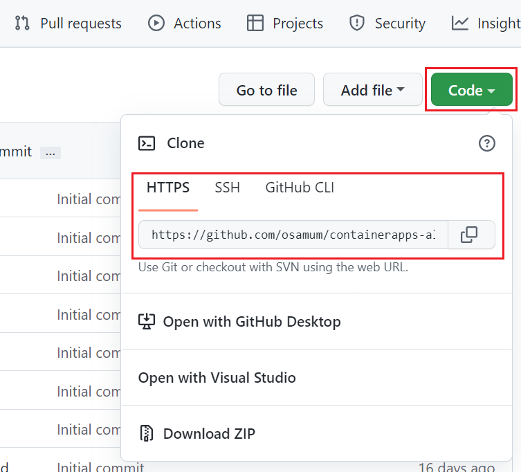

# 事前準備

ハンズオンの演習に入る前に必要な準備について紹介します。
<br><br>

## 1. アカウント
この演習では以下のアカウントが必要です。

お持ちでない場合は以下のリンク先で作成するか、提供されたチケット類がある場合は、提供元からの情報に従いアカウントを作成してください。

   - [**Microsoft Azure**](https://docs.microsoft.com/ja-jp/dotnet/azure/create-azure-account) のアカウント 
     
     Azure 上にリソースを作成するために必要です。

     お持ちでない方は以下のドキュメントに記載されているいずれかの方法でアカウントを入手してください。

      * [**Azure アカウントを作成する**](https://learn.microsoft.com/ja-jp/dotnet/azure/create-azure-account)


      アカウントが入手できたら使用するサブスクリプションの状態が下記のように `アクティブ` であることを、[Azure ポータル](https://portal.azure.com/#view/Microsoft_Azure_Billing/SubscriptionsBlade)より確認してください。
         
     
      ご利用のサブスクリプションの \[アクセス制御 (IAM)\] を開いて、`所有者` ロールもしくは `共同作成者` ロールとしてご利用のアカウントに割り当てられていることも併せて確認してください。  
       


   - [**GitHub**](https://github.com/join) のアカウント
     
     演習用リポジトリを作成、および、GitHub Actions を使用するために必要になります。

     お持ちでない方は以下のドキュメントに記載されているいずれかの方法でアカウントを入手してください。

      * [**Join GitHub - First, let's create your user account**](https://github.com/join)

<br />

## 2. ローカル開発環境とツール

### App Service (Web Apps) でホストするアプリケーションの開発環境

Azure App Service の演習で使用するアプリケーションは [.NET7](https://learn.microsoft.com/ja-jp/dotnet/core/whats-new/dotnet-7) の [ASP.NET Core MVC](https://learn.microsoft.com/ja-jp/aspnet/core/tutorials/first-mvc-app/start-mvc?view=aspnetcore-7.0&tabs=visual-studio) で作成されており、Visual Studio 開発用 DB(SQL Server Express LocalDB) を使用する都合上、Windows 上での動作を前提としています。

この演習用アプリケーションをビルドし、実行するための開発環境の作成方法はいくつかありますので、ご自身の環境に合わせ以下のいずれかの方法で開発環境を作成してください。

#### 1. Azure Dev Box を使用する

Azure には、この演習で使用する Visual Studio 2022、Visual Studio Code、Git ツールがあらかじめインストールされた仮想マシンのイメージが用意されています。

この環境を利用するには以下の URL にアクセスし、表示された画面の \[**今すぐ入手**\] ボタンをクリックし、Azure 上に仮想マシンを作成してください。

* [**Visual Studio 2022 (Microsoft Dev Box compatible)**](https://azuremarketplace.microsoft.com/ja/marketplace/apps/microsoftvisualstudio.visualstudioplustools?tab=Overview)

仮想マシンの作成が完了したら Microsoft Defender for Cloud が RDP の接続をブロックする可能性があるため、以下のページを参考にして、Microsoft Defender for Cloud の設定を変更してください。

* [**Microsoft Defender for Cloud を使用して JIT VM アクセスを操作する**](https://learn.microsoft.com/ja-jp/azure/defender-for-cloud/just-in-time-access-usage#work-with-jit-vm-access-using-microsoft-defender-for-cloud)


#### 2. ローカルの Windows マシンを使用する

ローカルの Windows 環境を使用して演習用プロジェクトをビルドする場合は Visual Studio 2022 が必要です。Visual Studio をお持ちでない場合は以下のサイトからライセンスに合致するものをダウンロードしてインストールすることができます。


* [**Visual Studio Tools のダウンロード**](https://visualstudio.microsoft.com/ja/downloads/)


#### 3. Windows 11 の仮想マシンを使用する

Windows 以外の OS を使用しており Visual Studio がインストールできない場合は、以下のページよりあらかじめ Visual Studio がインストールされた Windows 11 の仮想マシンをダウンロードして使用することができます。

* [**Windows 11 開発環境を取得する**](https://developer.microsoft.com/ja-jp/windows/downloads/virtual-machines/)

また、Windows を使用しているけれども Visual Studio をインストールしたくない場合は、Windows 11 付属の Hyper-V マネージャーのメニュー \[**クイック作成**\] から Visual Studio があらかじめインストールされた Windows 11 の仮想マシンを作成することができます。


仮想マシンのイメージのサイズは、使用する仮想化ソフトウェアによって異なりますが、Hyper-V の場合は 21.6GB 以上の空き容量が必要になります。

また、これら仮想環境の Windows は英語環境となっています。日本語環境を使用したい場合は、以下のページを参考にしてください。

* [**Windows で入力および表示言語の設定を管理する**](https://support.microsoft.com/ja-jp/windows/windows-%E3%81%A7%E5%85%A5%E5%8A%9B%E3%81%8A%E3%82%88%E3%81%B3%E8%A1%A8%E7%A4%BA%E8%A8%80%E8%AA%9E%E3%81%AE%E8%A8%AD%E5%AE%9A%E3%82%92%E7%AE%A1%E7%90%86%E3%81%99%E3%82%8B-12a10cb4-8626-9b77-0ccb-5013e0c7c7a2)


GitHub を使用するためには git ツールが必要になりますので、以下の URL よりダウンロードしてインストールしてください。

* [**Git-Downloading Packege**](https://git-scm.com/download/win)

また Visual Studio ローカルデータベースから Azure SQL Database への移行を行う際には、SQL Server Management Studio (SSMS) が必要になりますので以下の URLを参照しインストールしておいてください。

* [**SQL Server Management Studio (SSMS) のダウンロード**](https://learn.microsoft.com/ja-jp/sql/ssms/download-sql-server-management-studio-ssms?view=sql-server-ver16)


<br><br>

## 3. 演習で使用するプロジェクトの入手

演習で使用するアプリケーションのプロジェクトは、ハンズオンの GitHub Action の演習でご自身のリポジトリを使用していただくためテンプレート リポジトリとして作成されています。

テンプレート リポジトリ テンプレートを使用した新規リポジトリの作成手順は以下のとおりです。

 1. 以下の URL にアクセスし、画面内のボタン `[Use this template]` をクリックします  
      https://github.com/osamum/MvcMovie 
      
      <br>
    
2. `Create a new project from MvcMovie` 画面の各項目を以下のように設定します
      
     |  項目  |  値  |
     | ---- | ---- |   
     | Owner * | 自身のアカウント |
     | Repository name * | MvcMovie |
     | Description (Optional) | 任意の説明 |
     | Public or Private|Public にチェック|
     | Include all branches | チェックしない|
   <br>
    
3. 同ページの `[Create repository from template]` ボタンをクリックしてご自身の GitHub アカウントに `MvcMovie` リポジトリが作成されたことを確認します
 
4. 自身の GitHub に作成された `MvcMovie` リポジトリの \[**Code**\] ボタンをクリックし、リポジトリの URL をコピーします

   

5. リポジトリの URL をコピーしたら、ターミナル画面で以下のコマンドを実行し、リポジトリをローカルにクローンします

   ```bash
   git clone コピーした URL
   ```

エクスプローラー等で、クローンしたリポジトリのフォルダが作成されていることを確認します。

<br><br>


## 5. ローカル環境でのプロジェクトの実行

PC ローカルにクローンしたプロジェクトをビルドして実行する手順は以下のとおりです。

1. Visual Studio 2022 を起動し、メニューの \[**ファイル**\] > \[**開く**\] > \[**プロジェクト/ソリューション**\] を選択します

2. ファイル選択ダイアログで、クローンしたプロジェクトのフォルダを選択し、`MvcMovie.sln` を選択して開きます

3. メニューの \[**ビルド**\] > \[**ソリューションのリビルド**\] を選択し、プロジェクトの依存関係のあるモジュールを再取得してビルドします

4. メニューの \[**ツール**\] > \[**Nuget パッケージマネージャー**\] > \[**パッケージ マネージャー コンソール**\] を選択し、Nuget パッケージマネージャー コンソールを開きます

5. Nuget パッケージマネージャー コンソールで、以下の 2 つのコマンドを順番に実行し、データベースを作成し、既定のデータを挿入します

    ```powershell
    Add-Migration InitialCreate
    Update-Database
    ```
6. メニューの \[**デバッグ**\] > \[**デバッグの開始**\] を選択し、プロジェクトを実行します

7. ブラウザーが起動し、`https://localhost:61260/` にアクセスします
    https で接続されるため、Web ブラウザーによってはセキュリティ警告が表示されます。

    以下のダイアログが表示された場合は、いずれも \[**はい**\] ボタンをクリックしてください。

    


    

    その他については警告を無視してアクセスしてください。

    もし、警告の無視ができない場合は Web ブラウザーのナビゲーションバーにある URL の先頭の `https` を `http` に、ポート番号の `61260` を `61261` に変更してください。

8. アプリケーションが起動し、以下のような画面が表示されます

    

    これは ASP.NET MVC フレームワークがサーバーサイドで生成した画面です。

9. Web ブラウザーのナビゲーションバーの URL を以下のように変更します
    
    ```
    http://localhost:61261/index.html
    ```
    
    一見すると同じ画面に見えますが、左上に '**SPA**' とあるように、これは Single Page Application (SPA) となっており、クライアントサイドで JavaScript によって生成された画面です。

    

    SPA 画面は動的 Web ページの画面と同じ機能を提供しますが、映画タイトル リストの \[**Edit**\] リンクをクリックした際に表示される編集画面で \[**Update**\] ボタンをクリックすると、以下のようなエラーが表示されるようになっています。

    

    このエラーは演習で使用します。

10. Web ブラウザーのナビゲーションバーの URL を以下のように変更します

    ```
    http://localhost:61260/api/movie
    ```
    この URL は REST API のエンドポイントとなっており、JSON 形式のデータが返されます。前述の SPA もこの REST API を使用して動作しています。

    

ここまでの手順で、本プロジェクトのビルドと実行が完了しました。

このアプリケーションの機能と URL の対応は以下のとおりです。

|  URL |  機能  |
| ---- | ---- |   
| http://localhost:61260/ | 動的 Web 画面 |
| http://localhost:61260/index.html | SPA |
| http://localhost:61260/api/movie | REST API |

<br>

以降、PaaS ハンズオンではこのアプリケーションを Azure App Service にデプロイし、さまざまな設定や機能を実際に作業をしながら紹介しています。


<br>

---
👉 : [**演習1) タスク１ - ローカル環境でのプロジェクトの実行**](ex01.md)へ

🏚️ :  [**README**](README.md)


